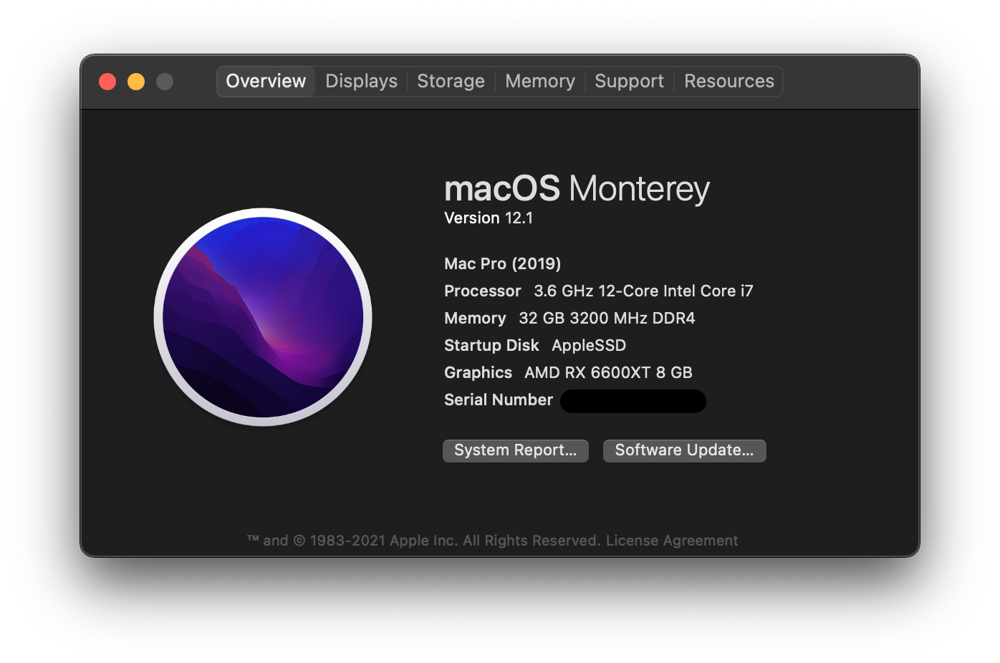
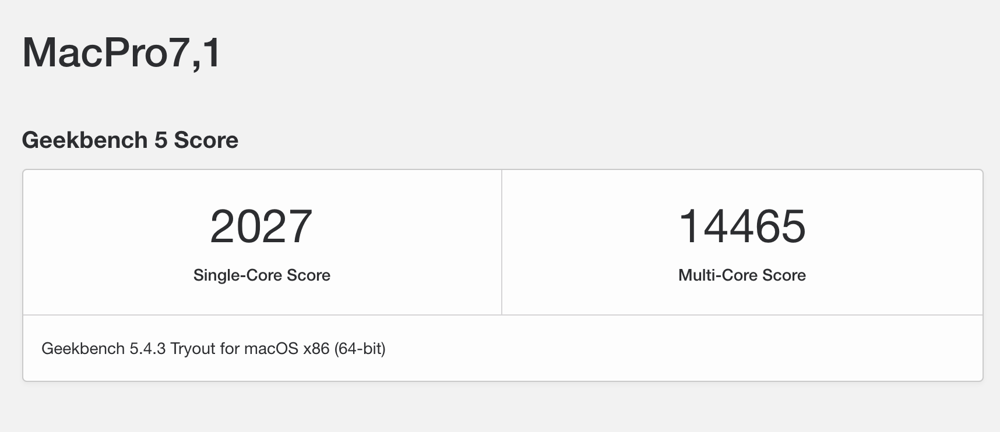
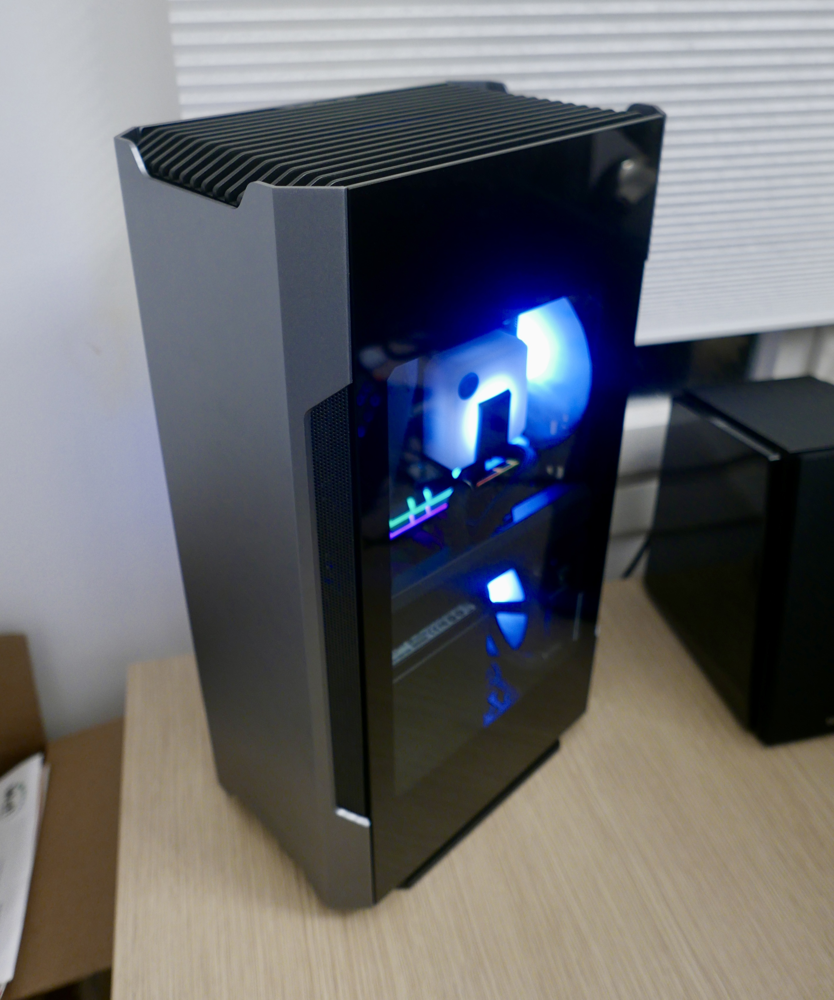

# Gigabyte Z690I Aorus Hackintosh EFI

EFI Partition and Guidelines for my Mini-ITX Hackintosh



## Changelog

```
0.0.5 - updated to OC 0.7.9 + Latest Kexts.

0.0.4 - updated to OC 0.7.8 + Latest Kexts. Re Enabled GPRW patches for sleep stability.

0.0.3 - updated OC, removed unused SSDTS, Kexts.
replaced BCM94352Z with BCM94360NG

0.0.2 - replaced all <integer>3</integer> with <integer>255</integer>
inside USBPorts.kext for USB3. this change fixes insta-wake,
therefore we can delete GPRW patches

0.0.1 - initial release
```

## Hardware

- Phanteks Evolv Shift 2 Air
- Gigabyte Z690I Aorus
- Intel Core i7-12700K
- EK-AIO 120 D-RGB
- G.Skill TridentZ RGB 2x16GB DDR4-3200CL14
- Gigabyte RX 6600XT 8GB OC
- LinkUP PCI-E 4.0 Riser
- 2xWD Black SN850 1TB NVMe
- Corsair SF500W
- BCM94360NG WiFi/BT

## Config

- SMBIOS - MacPro7,1
- Verbose Off
- Scaled for 4K
- `agdpmod=pikera` is enabled for AMD GPU

## Bios

- CFG-Lock - off
- Fast Boot - off
- VT-d - off
- CSM - off
- VT-x - on
- Above 4G decoding - on
- Re-Size BAR Support - on
- XHCI Hand-off - on

## Overclocking

- VCore: Fixed 1.28V
- DVID: -0.045
- LLC: 3
- P 0-1: 50
- P 2-7: 49
- E 0-3: 39

---




